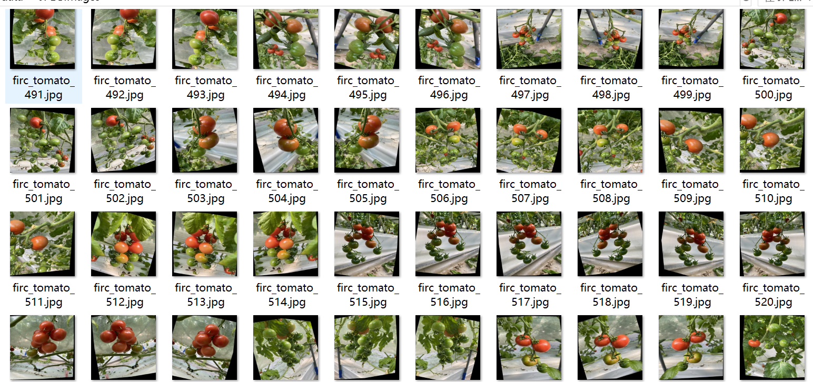
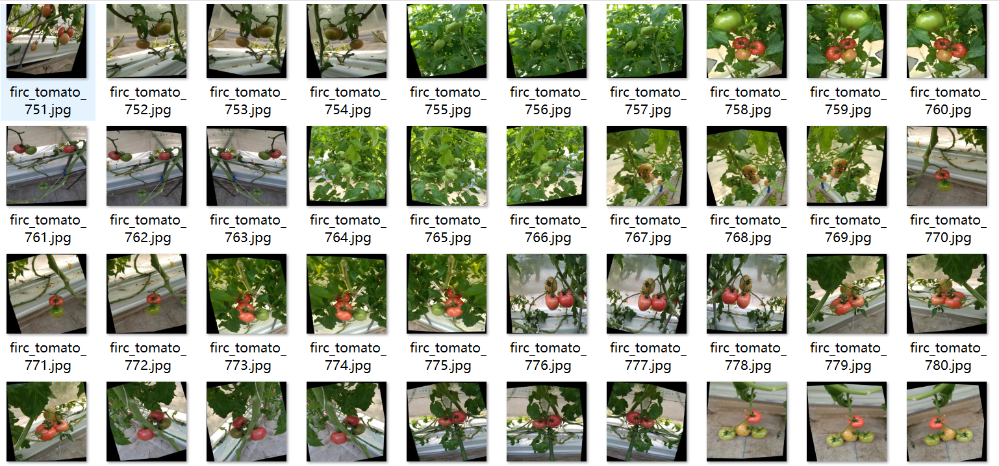
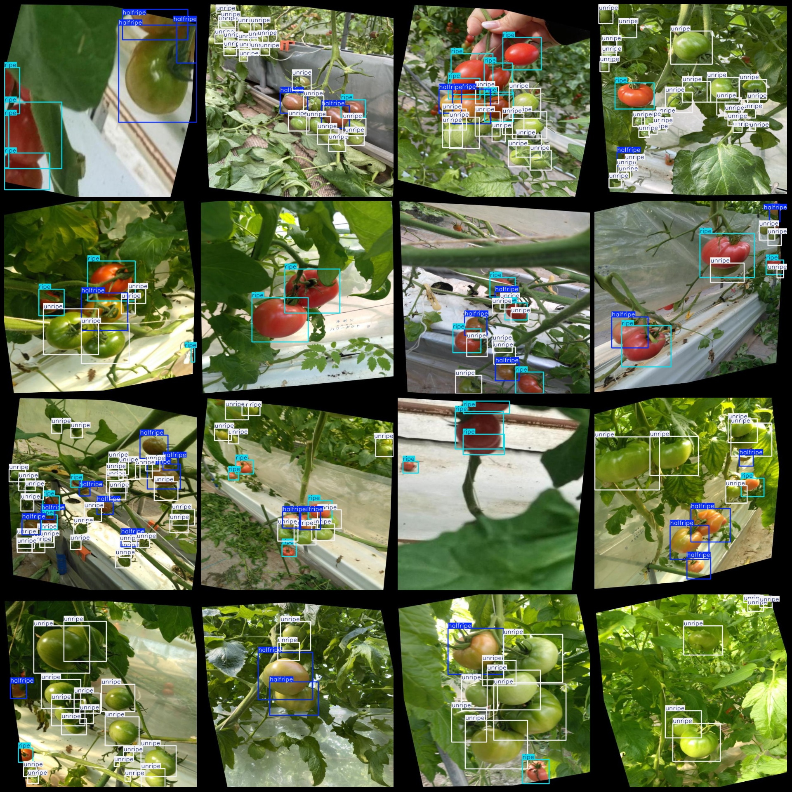
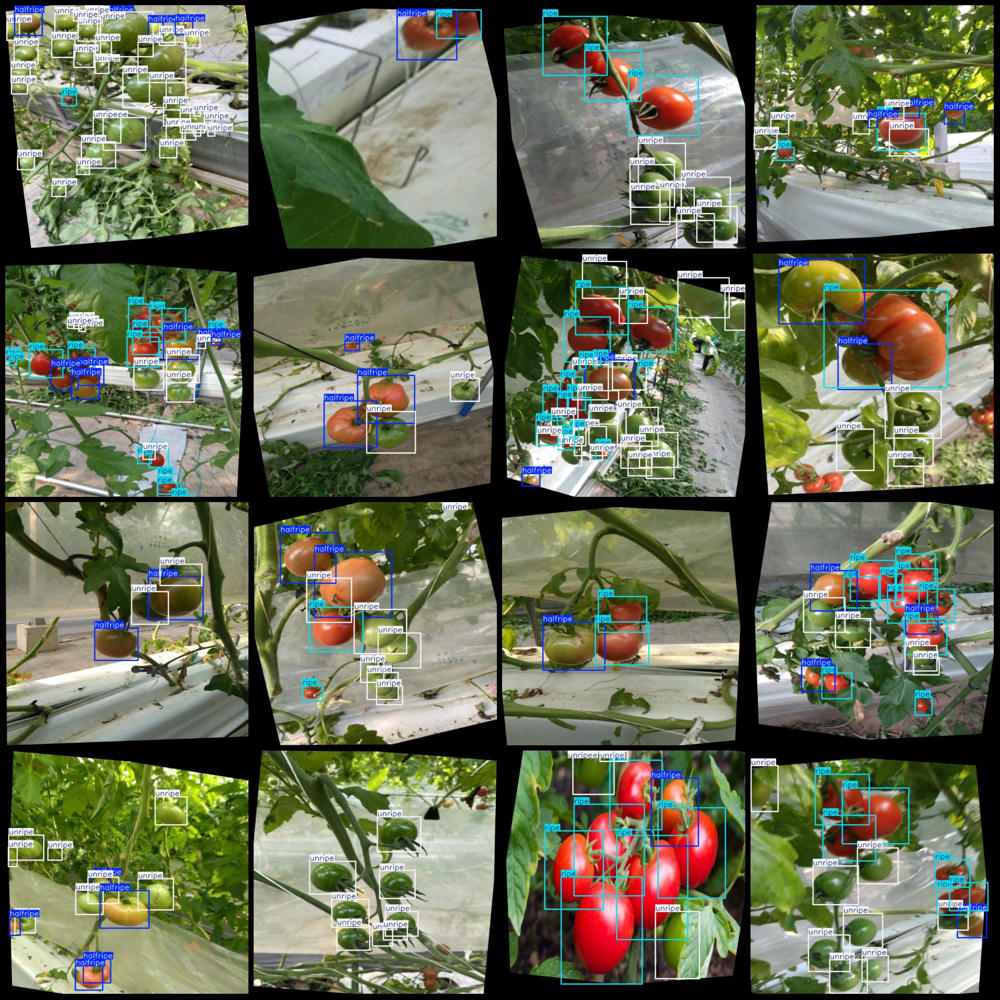

# Tomato ripeness detection dataset VOC+YOLO format, 2260 images with three categories enhanced

Please note that in the dataset, more than half of the images are enhanced. Please refer to the image for details.

The dataset format is Pascal VOC format+YOLO format (without the split path in the txtfile, only the jpgimage and the corresponding VOC format xmlfile and yolo format txtfile).

number of images: 2260
annotation count: 2260
annotation count: 2260
annotationnumber of classes: 3
Annotation class names: ["halfripe", "ripe", "unripe"]

boxes per class: 
The box count for half-ripe (half-ripe) is 4176.
The box count for ripe (fully ripe) is 5589.
The box count for unripe (unripe) is 15271.

Total frames: 25036

Image resolution: 640x640

Use the labeling tool: labelImg

Rules for Annotation: Draw a rectangle around the category.

Important Notice: None

Special Disclaimer: This dataset does not make any guarantees about the accuracy of the trained model or the weights file.

Preview of the image:
## Image

Here is a pay link on Stripe ( https://buy.stripe.com/3cs8yP7sY87d0vu9AB ). Please contact me lonlonago@foxmail.com after funding $89, and I will send you a complete data files , thank you!

